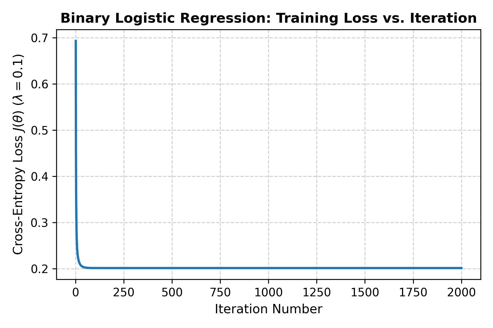
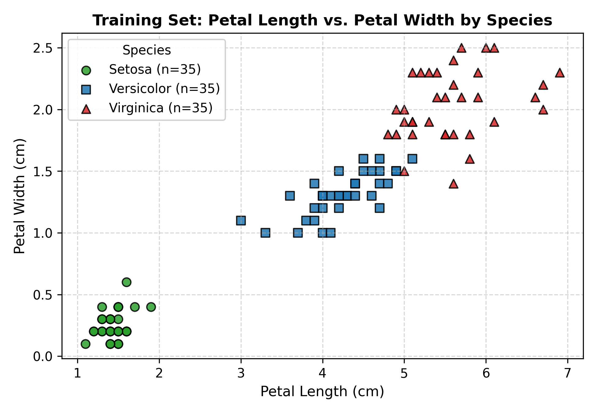

## Introduction

In this assignment, we implement and compare two different ways to classify the three species in the Iris dataset using linear models. We build a two-stage binary classifier chained together with probability rules and compare it to a single multinomial softmax regression model.

## Part 1: Binary Logistic Regression

### Task 1.1: Binary Implementation

So basiclaly binary logistic regression, we predicted $p_i = \sigma(x_{b,i}^T \theta)$ where $x_{b,i}$ has a 1 prepended for the bias term, and $\theta$ is the weight vector.

* **Numerically Stable Sigmoid:** And then to make sure `np.exp` never overflows when $z = \pm 1000$, we clip $z$ to $[-500, 500]$ before exponentiating:
  $$\sigma(z) = \frac{1}{1 + e^{-\text{clip}(z, -500, 500)}}$$
  This avoids any runtime overflow warnings completely.
* **Loss and Gradient:** We minimized the L2-regularized mean cross-entropy loss from Equation 1:
  $$J(\theta) = -\frac{1}{n} \sum_{i=1}^n \left[ y_i \log(p_i) + (1 - y_i) \log(1 - p_i) \right] + \frac{\lambda}{2} \sum_{j=1}^d \theta_j^2$$
  We clip probabilities to $[10^{-12}, 1 - 10^{-12}]$ so we never hit $\log(0)$. Notice that the bias weight $\theta_0$ is left out of the regularization sum. The gradient from Equation 2 is:
  $$\nabla J(\theta) = \frac{1}{n} X_b^T (p - y) + \lambda \tilde{\theta}, \quad \text{where } \tilde{\theta} = [0, \theta_1, \dots, \theta_d]^T$$
* **Model Class:** The binary clasifier was implemented in `BinaryLogisticRegression` with `fit`, `predict_proba`, and `predict` (threshold at 0.5). It ran vectorized batch gradient descent ($\theta \leftarrow \theta - \eta \nabla J(\theta)$) without sample loops and saves the loss at each step in `self.loss_history`.

### Task 1.2: Setosa vs. Rest Classification

We trained the model on the binary task "setosa (label 1) vs rest (label 0)" using $\lambda = 0.1$, $\eta = 0.5$, and 2000 iterations on the standardized training split ($N = 105$). The goal was to seperate setosa from the other two classes.

* **Train Accuracy:** 1.0000 (105/105)
* **Test Accuracy:** 1.0000 (45/45)
* **Loss Value:** The loss starts at 0.693147 on step 0 and drops down to 0.201605 by step 2000.

{width=45%}

As shown in Figure 1 above, the training loss decreases at every single iteration step and then levels out once it converges, which shows the gradient and step size are working properly.

## Part 2: Two Binary Classifiers vs. Softmax

### Task 2.1: Two-Stage Classifier Implementation

Our `TwoStageClassifier` breaks the 3-class problem into two steps:

1. **Stage 1:** "Is this flower setosa or not?" trained on all 105 training samples. It outputs $q_1 = P(\text{setosa} \mid x)$.
2. **Stage 2:** "Is this versicolor or virginica?" trained only on the 70 non-setosa training samples. It outputs $q_2 = P(\text{virginica} \mid x, \text{not setosa})$.

We then combine them using the probabilty chain rule from Equation 3:
$$P(\text{setosa}) = q_1, \quad P(\text{versicolor}) = (1 - q_1)(1 - q_2), \quad P(\text{virginica}) = (1 - q_1)q_2$$

Because $q_1 + (1 - q_1)(1 - q_2) + (1 - q_1)q_2 = 1.0$, every predicted row sums to 1. `predict` just takes the argmax across classes.

### Task 2.2: Softmax Regression Implementation

Softmax regression handles all 3 classes at the same time using a weight matrix $W$ of shape $(d+1) \times 3$.

* **Stable Softmax:** To prevent large numbers from blowing up, we subtract the row maximum before calling `np.exp`:
  $$P_{ik} = \frac{e^{S_{ik} - \max_j S_{ij}}}{\sum_{m=1}^3 e^{S_{im} - \max_j S_{ij}}}$$
  This prevents NaN outputs even for inputs like $[-1000, 0, 1000]$.
* **Loss and Gradient:** With one-hot labels $Y$, we minimize Equation 4:
  $$J(W) = -\frac{1}{n} \sum_{i=1}^n \sum_{k=1}^3 Y_{ik} \log(P_{ik}) + \frac{\lambda}{2} \sum_{j=1}^d \sum_{k=1}^3 W_{jk}^2$$
  The gradient from Equation 5 is:
  $$\nabla_W J(W) = \frac{1}{n} X_b^T (P - Y) + \lambda \tilde{W}$$
  where $\tilde{W}$ has row 0 set to 0 so the bias row is unpenalized.
* **Model Class:** `SoftmaxRegression` runs batch gradient descent for 3000 iterations with $\eta = 0.5$ and $\lambda = 0.01$.

### Task 2.3: Comparison Table

Both models were trained on the exact same standardized training data and tested on the 45 test samples with seed 0.

| Model | Train Accuracy | Test Accuracy | Macro Precision | Macro Recall | Macro F1 |
| :--- | :---: | :---: | :---: | :---: | :---: |
| **Two-Stage Classifier** | 0.9810 (103/105) | 0.9111 (41/45) | 0.9111 | 0.9111 | 0.9111 |
| **Softmax Regression** | 0.9810 (103/105) | 0.9333 (42/45) | 0.9345 | 0.9333 | 0.9333 |

Table: Performance metrics on the seed 0 split (45 test samples: 15 per class).

Here are the test confusion matrices (orientation: rows are the true class, columns are the predicted class):

**Two-Stage Classifier Confusion Matrix:**

| True \ Pred | Predicted Setosa | Predicted Versicolor | Predicted Virginica |
| :--- | :---: | :---: | :---: |
| **True Setosa** | 15 | 0 | 0 |
| **True Versicolor** | 0 | 13 | 2 |
| **True Virginica** | 0 | 2 | 13 |

**Softmax Regression Confusion Matrix:**

| True \ Pred | Predicted Setosa | Predicted Versicolor | Predicted Virginica |
| :--- | :---: | :---: | :---: |
| **True Setosa** | 15 | 0 | 0 |
| **True Versicolor** | 0 | 13 | 2 |
| **True Virginica** | 0 | 1 | 14 |

## Part 3: Short-Answer Interpretation

### Task 3.1: Confusion Matrix and Scatter Plot Analysis

* **Confused Pairs:** The only classes that ever get confused are versicolor and virginica. Two-stage mixes up 4 samples (2 versicolor predicted as virginica, and 2 virginica predicted as versicolor). Softmax only mixes up 3 samples (2 versicolor predicted as virginica, and 1 virginica predicted as versicolor).
* **Setosa Mistakes:** Setosa is never involved in a single mistake for either model. Both got 15/15 correct with 0 false alarms and 0 misses.
* **Scatter Plot Connection:** Looking at the scatter plot of petal length against petal width in Figure 2, setosa sits completely on its own in the lower left (petal length $\le 1.9$ cm, petal width $\le 0.6$ cm) with a large gap separating it. On the other hand, versicolor and virginica border each other and they defintely overlap in the scatter plot around petal length 4.5 to 5.1 cm and petal width 1.4 to 1.8 cm. Since linear models just draw straight decision boundaries, those borderline flowers get confused.

{width=45%}

### Task 3.2: Why We Need the Chain Rule

* **Why not $\max(q_1, q_2)$:** We cannot just pick the class with $\max(q_1, q_2)$ because $q_1$ and $q_2$ answer two totally different questions. $q_1$ is $P(\text{setosa} \mid x)$, while $q_2$ is $P(\text{virginica} \mid x, \text{not setosa})$. Stage 2 was only trained on non-setosa rows, so if you give it a setosa flower, its weights are seeing data it never trained on and might spit out something random like $q_2 = 0.95$. If $q_1 = 0.90$, doing $\max(0.90, 0.95)$ would call it virginica even though stage 1 was 90% sure it was setosa.
* **Role of $(1 - q_1)$:** The factor $(1 - q_1)$ represents $P(\text{not setosa} \mid x)$ and acts as a gate. By the chain rule:
  $$P(\text{virginica} \mid x) = P(\text{not setosa} \mid x) \cdot P(\text{virginica} \mid x, \text{not setosa}) = (1 - q_1) q_2$$
  $$P(\text{versicolor} \mid x) = P(\text{not setosa} \mid x) \cdot P(\text{versicolor} \mid x, \text{not setosa}) = (1 - q_1)(1 - q_2)$$
  If the flower is setosa, $q_1 \approx 1$, so $(1 - q_1) \approx 0$ shuts down whatever stage 2 says in the final calculaton. This makes sure all three probabilities are valid unconditional probabilities that sum to 1.

### Task 3.3: Model Recommendation

We recommend using **Softmax Regression** for this problem:

1. **Accuracy Numbers:** Softmax got higher test accuracy (93.33% vs 91.11%), making only 3 mistakes compared to 4 mistakes for the two-stage model. It correctly classified 14/15 virginica test samples instead of 13/15, and had higher macro precision (0.9345 vs 0.9111).
2. **Joint Optimization:** Softmax trains all class boundaries together under one loss function. In the two-stage setup, stage 2 is trained in isolation on only 70 samples, and any mistake in stage 1 carries through with no way to recover.
3. **Simplicity:** Softmax just needs one weight matrix $W$ and one forward pass rather than coordinating two separate models.

## Reproducibility and Seeds

All experiments and splits were performed using `seed = 0` using `stratified_split(X, y, test_fraction=0.3, seed=0)`.
